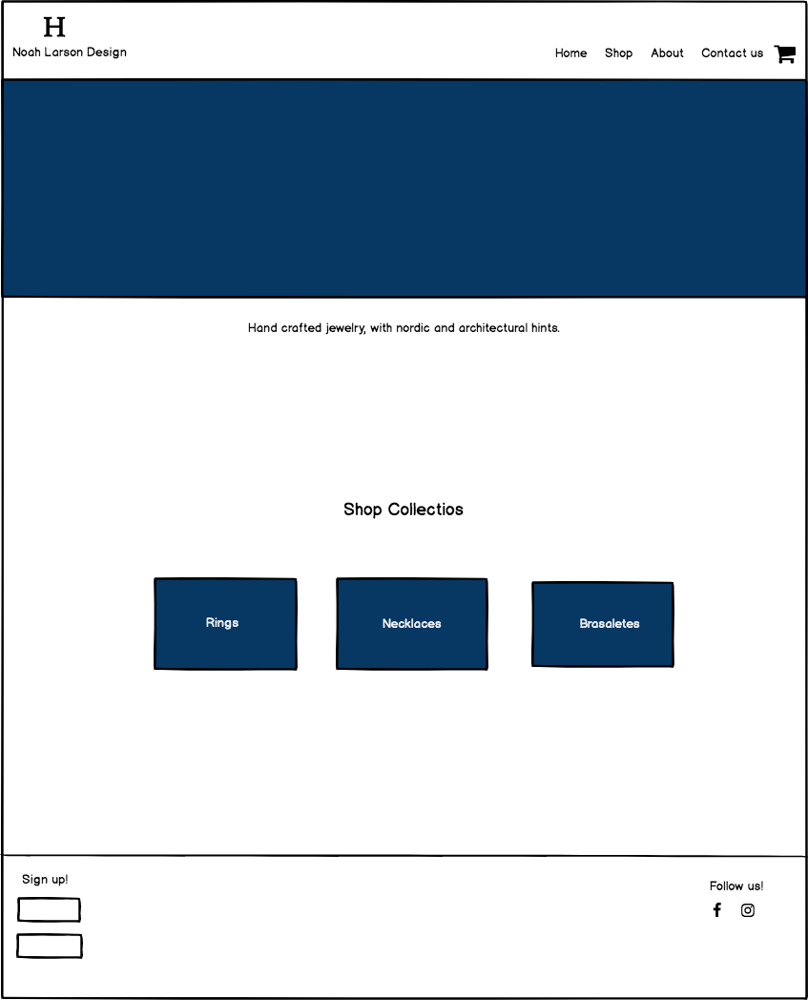
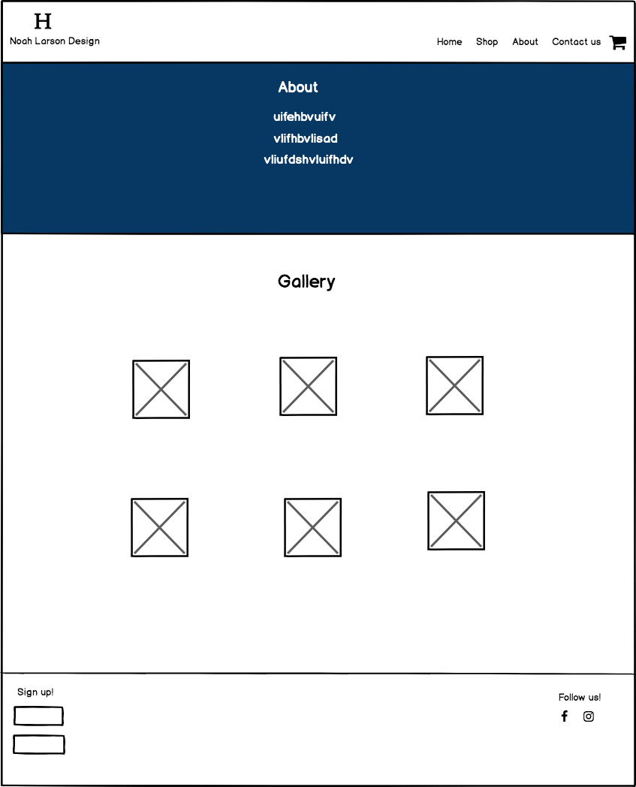
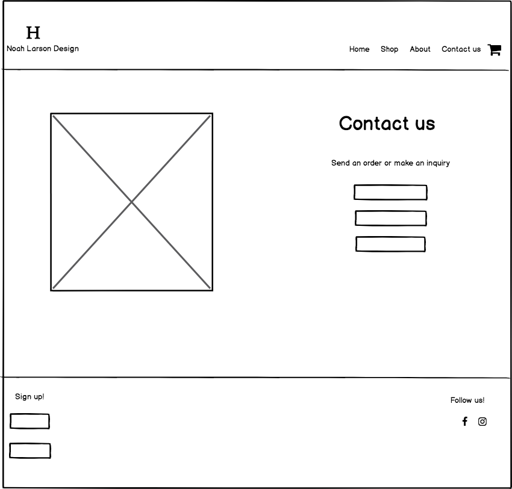
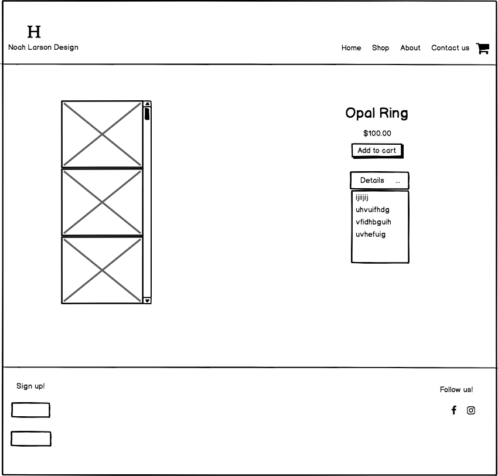

# Noah Larson Design
This is an online shop, that features Noah Larson's Jewelry.

## Specifications

* As a client, you are able to see all available products, with details.
* As an admin, you are able to fill out a form to add products to the store, with fotos and description.
* As an admin, you are able to edit any product fotos and/or description.
* As an admin, you are able to delete any product fotos and/or description.
* As an admin you are able to do admin tasks that the user can't see.
* As a client you are able to add products to your shopping cart.
* As a client you are able to check out the products added to your shopping cart.
* As a client you are able to sign up for news letter.

This project was generated with [Angular CLI](https://github.com/angular/angular-cli) version 1.6.5.

## Technical Features
* Angular
* Firebase
* JavaScript
* Bootstrap
* HTML
* CSS

## Development server

Run `ng serve` for a dev server. Navigate to `http://localhost:4200/`. The app will automatically reload if you change any of the source files.

## Code scaffolding

Run `ng generate component component-name` to generate a new component. You can also use `ng generate directive|pipe|service|class|guard|interface|enum|module`.

## Build

Run `ng build` to build the project. The build artifacts will be stored in the `dist/` directory. Use the `-prod` flag for a production build.

## Running unit tests

Run `ng test` to execute the unit tests via [Karma](https://karma-runner.github.io).

## Running end-to-end tests

Run `ng e2e` to execute the end-to-end tests via [Protractor](http://www.protractortest.org/).

## Further help

To get more help on the Angular CLI use `ng help` or go check out the [Angular CLI README](https://github.com/angular/angular-cli/blob/master/README.md).

## Support and contact details

If you have any questions or problems, please contact
* Nadia P Lizcano(priscila.lizcano@gmail.com)